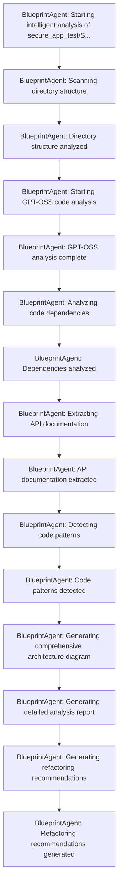

# AutoDevCore Thought Trail

```mermaid
graph TD
    A0["BlueprintAgent: Starting intelligent analysis of secure_app_test/S..."]
    A1["BlueprintAgent: Scanning directory structure"]
    A0 --> A1
    A2["BlueprintAgent: Directory structure analyzed"]
    A1 --> A2
    A3["BlueprintAgent: Starting GPT-OSS code analysis"]
    A2 --> A3
    A4["BlueprintAgent: GPT-OSS analysis complete"]
    A3 --> A4
    A5["BlueprintAgent: Analyzing code dependencies"]
    A4 --> A5
    A6["BlueprintAgent: Dependencies analyzed"]
    A5 --> A6
    A7["BlueprintAgent: Extracting API documentation"]
    A6 --> A7
    A8["BlueprintAgent: API documentation extracted"]
    A7 --> A8
    A9["BlueprintAgent: Detecting code patterns"]
    A8 --> A9
    A10["BlueprintAgent: Code patterns detected"]
    A9 --> A10
    A11["BlueprintAgent: Generating comprehensive architecture diagram"]
    A10 --> A11
    A12["BlueprintAgent: Generating detailed analysis report"]
    A11 --> A12
    A13["BlueprintAgent: Generating refactoring recommendations"]
    A12 --> A13
    A14["BlueprintAgent: Refactoring recommendations generated"]
    A13 --> A14
```
