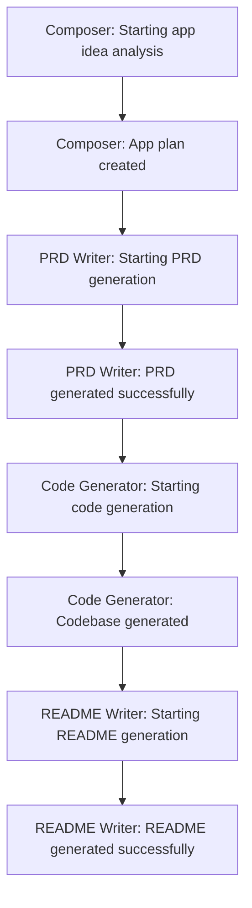

# AutoDevCore Thought Trail

```mermaid
graph TD
    A0["Composer: Starting app idea analysis"]
    A1["Composer: App plan created"]
    A0 --> A1
    A2["PRD Writer: Starting PRD generation"]
    A1 --> A2
    A3["PRD Writer: PRD generated successfully"]
    A2 --> A3
    A4["Code Generator: Starting code generation"]
    A3 --> A4
    A5["Code Generator: Codebase generated"]
    A4 --> A5
    A6["README Writer: Starting README generation"]
    A5 --> A6
    A7["README Writer: README generated successfully"]
    A6 --> A7
```
