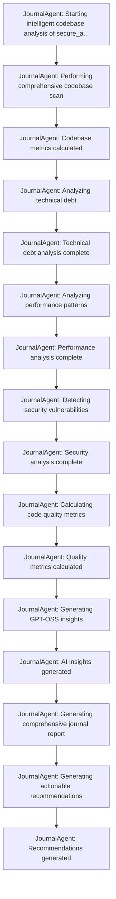

# AutoDevCore Thought Trail

```mermaid
graph TD
    A0["JournalAgent: Starting intelligent codebase analysis of secure_a..."]
    A1["JournalAgent: Performing comprehensive codebase scan"]
    A0 --> A1
    A2["JournalAgent: Codebase metrics calculated"]
    A1 --> A2
    A3["JournalAgent: Analyzing technical debt"]
    A2 --> A3
    A4["JournalAgent: Technical debt analysis complete"]
    A3 --> A4
    A5["JournalAgent: Analyzing performance patterns"]
    A4 --> A5
    A6["JournalAgent: Performance analysis complete"]
    A5 --> A6
    A7["JournalAgent: Detecting security vulnerabilities"]
    A6 --> A7
    A8["JournalAgent: Security analysis complete"]
    A7 --> A8
    A9["JournalAgent: Calculating code quality metrics"]
    A8 --> A9
    A10["JournalAgent: Quality metrics calculated"]
    A9 --> A10
    A11["JournalAgent: Generating GPT-OSS insights"]
    A10 --> A11
    A12["JournalAgent: AI insights generated"]
    A11 --> A12
    A13["JournalAgent: Generating comprehensive journal report"]
    A12 --> A13
    A14["JournalAgent: Generating actionable recommendations"]
    A13 --> A14
    A15["JournalAgent: Recommendations generated"]
    A14 --> A15
```
