# AutoDevCore Thought Trail Visualization

## Agent Reasoning Flow

```mermaid
graph TD
    A0["JournalAgent<br/>Starting intelligent codebase analysis o..."]
    style A0 fill:#98D8C8
    A1["JournalAgent<br/>Performing comprehensive codebase scan"]
    style A1 fill:#98D8C8
    A0 --> A1
    A2["JournalAgent<br/>Codebase metrics calculated"]
    style A2 fill:#98D8C8
    A1 --> A2
    A3["JournalAgent<br/>Analyzing technical debt"]
    style A3 fill:#98D8C8
    A2 --> A3
    A4["JournalAgent<br/>Technical debt analysis complete"]
    style A4 fill:#98D8C8
    A3 --> A4
    A5["JournalAgent<br/>Analyzing performance patterns"]
    style A5 fill:#98D8C8
    A4 --> A5
    A6["JournalAgent<br/>Performance analysis complete"]
    style A6 fill:#98D8C8
    A5 --> A6
    A7["JournalAgent<br/>Detecting security vulnerabilities"]
    style A7 fill:#98D8C8
    A6 --> A7
    A8["JournalAgent<br/>Security analysis complete"]
    style A8 fill:#98D8C8
    A7 --> A8
    A9["JournalAgent<br/>Calculating code quality metrics"]
    style A9 fill:#98D8C8
    A8 --> A9
    A10["JournalAgent<br/>Quality metrics calculated"]
    style A10 fill:#98D8C8
    A9 --> A10
    A11["JournalAgent<br/>Generating GPT-OSS insights"]
    style A11 fill:#98D8C8
    A10 --> A11
    A12["JournalAgent<br/>AI insights generated"]
    style A12 fill:#98D8C8
    A11 --> A12
    A13["JournalAgent<br/>Generating comprehensive journal report"]
    style A13 fill:#98D8C8
    A12 --> A13
    A14["JournalAgent<br/>Generating actionable recommendations"]
    style A14 fill:#98D8C8
    A13 --> A14
    A15["JournalAgent<br/>Recommendations generated"]
    style A15 fill:#98D8C8
    A14 --> A15
```

## Timeline View

| Timestamp | Agent | Thought |
|-----------|-------|--------|
| 00:43:32 | JournalAgent | Starting intelligent codebase analysis of secure_app_test/Se... |
| 00:43:32 | JournalAgent | Performing comprehensive codebase scan |
| 00:43:32 | JournalAgent | Codebase metrics calculated |
| 00:43:32 | JournalAgent | Analyzing technical debt |
| 00:43:32 | JournalAgent | Technical debt analysis complete |
| 00:43:32 | JournalAgent | Analyzing performance patterns |
| 00:43:32 | JournalAgent | Performance analysis complete |
| 00:43:32 | JournalAgent | Detecting security vulnerabilities |
| 00:43:32 | JournalAgent | Security analysis complete |
| 00:43:32 | JournalAgent | Calculating code quality metrics |
| 00:43:32 | JournalAgent | Quality metrics calculated |
| 00:43:32 | JournalAgent | Generating GPT-OSS insights |
| 00:48:32 | JournalAgent | AI insights generated |
| 00:48:32 | JournalAgent | Generating comprehensive journal report |
| 00:48:32 | JournalAgent | Generating actionable recommendations |
| 00:48:32 | JournalAgent | Recommendations generated |
