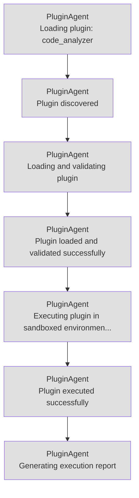

# AutoDevCore Thought Trail Visualization

## Agent Reasoning Flow

## Timeline View

| Timestamp | Agent | Thought |
|-----------|-------|--------|
| 00:52:41 | PluginAgent | Loading plugin: code_analyzer |
| 00:52:41 | PluginAgent | Plugin discovered |
| 00:52:41 | PluginAgent | Loading and validating plugin |
| 00:52:41 | PluginAgent | Plugin loaded and validated successfully |
| 00:52:41 | PluginAgent | Executing plugin in sandboxed environment |
| 00:52:41 | PluginAgent | Plugin executed successfully |
| 00:52:41 | PluginAgent | Generating execution report |
