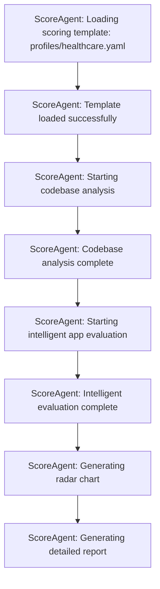

# AutoDevCore Thought Trail

```mermaid
graph TD
    A0["ScoreAgent: Loading scoring template: profiles/healthcare.yaml"]
    A1["ScoreAgent: Template loaded successfully"]
    A0 --> A1
    A2["ScoreAgent: Starting codebase analysis"]
    A1 --> A2
    A3["ScoreAgent: Codebase analysis complete"]
    A2 --> A3
    A4["ScoreAgent: Starting intelligent app evaluation"]
    A3 --> A4
    A5["ScoreAgent: Intelligent evaluation complete"]
    A4 --> A5
    A6["ScoreAgent: Generating radar chart"]
    A5 --> A6
    A7["ScoreAgent: Generating detailed report"]
    A6 --> A7
```
