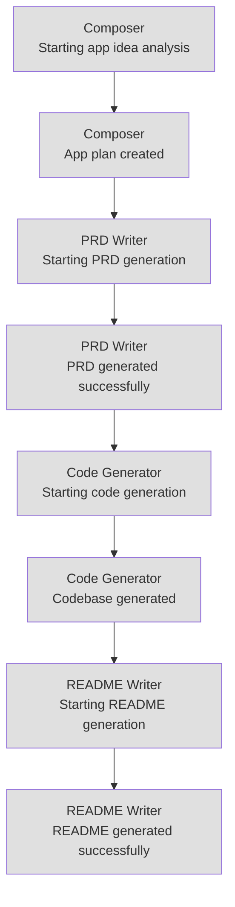

# AutoDevCore Thought Trail Visualization

## Agent Reasoning Flow

## Timeline View

| Timestamp | Agent | Thought |
|-----------|-------|--------|
| 01:53:45 | Composer | Starting app idea analysis |
| 01:58:45 | Composer | App plan created |
| 01:58:45 | PRD Writer | Starting PRD generation |
| 01:58:45 | PRD Writer | PRD generated successfully |
| 01:58:45 | Code Generator | Starting code generation |
| 01:58:45 | Code Generator | Codebase generated |
| 01:58:45 | README Writer | Starting README generation |
| 01:58:45 | README Writer | README generated successfully |
